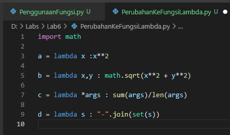
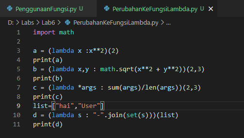
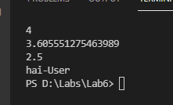
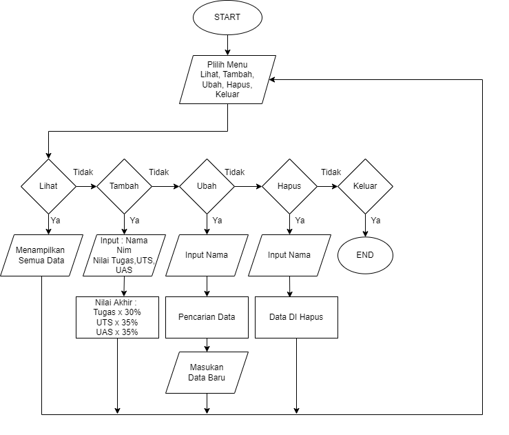
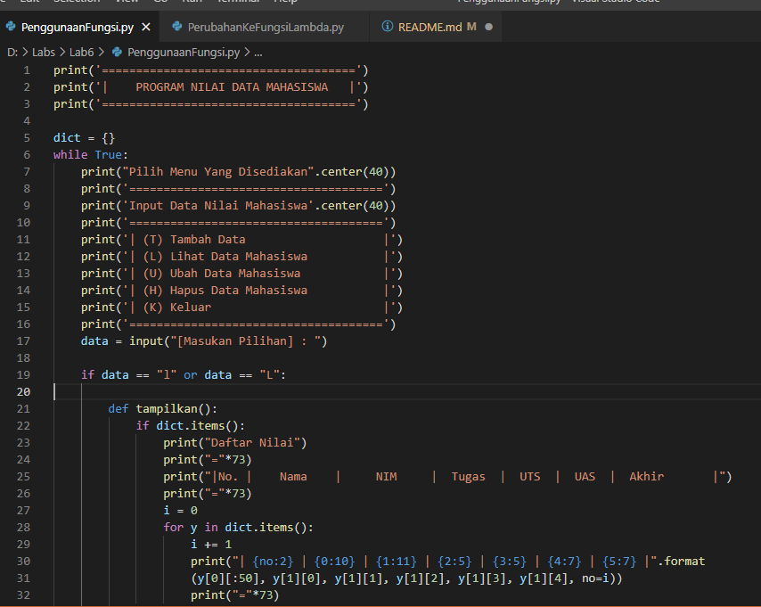
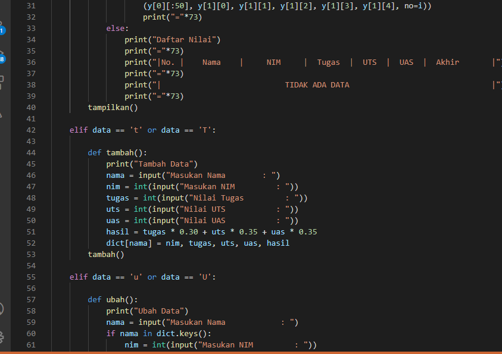
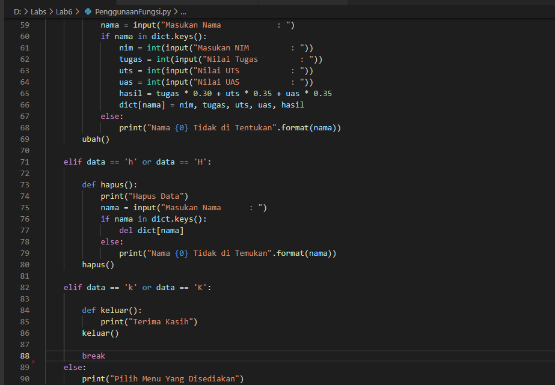

# Lab6
## Latihan
### Perubahan ke fungsi lambda
#### Pada latihan ini mengubah kode def menjadi fungsi menggunakan lambda
#### Berikut hasil contoh perubahanya                                                                    

#### Berikut Contoh menggunakan fungsi Printnya                                                                          

#### Berikut hasil Program ketika di jalankan                                                                                    

## Praktikum 6
### Program Melihat, Menginput, Mengubah, Dan Menghapus Data
Program sederhana dengan mengaplikasikan penggunaan fungsi yang akan menampilkan daftar nilai mahasiswa
#####
Disini saya menggunakan Fungsi dari dictionary juga untuk menyimpan data dari inputan
#####
Cara kerja program
#####
Ketika di run Program menyediakan menu menu yang bisa anda pilih seperti

"L" untuk fungsi lihat
guna fungsi lihat untuk melihat list dengan data yang tersimpan

"T" untuk fungsi Tambah
guna fungsi tambah, kita di minta untuk menginput Nama, Nim, Nilai Tugas, Nilai UTS, Nilai UAS lalu program akan menyimpan datanya di dictionary untuk melihat hasil

"U" untuk fungsi Ubah
guna fungsi ini untuk mengubah data jika ada kesalahan saat input

"H" untuk fungsi Hapus
guna fungsi ini untuk menghapus data yang sudah kita input

"K" untuk fungsi Keluar
guna fungsi ini untuk keluar dari program
#### Berikut Cara Kerja Berdasarkan Flowchartnya

#### Berikut Bentuk dari Code Python Nya

